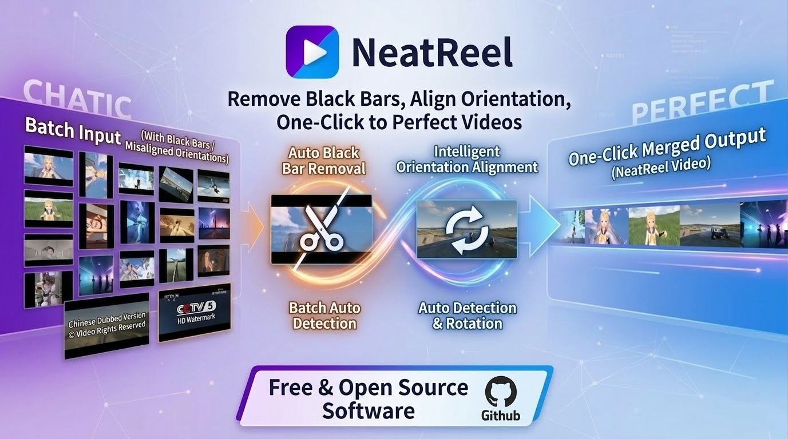
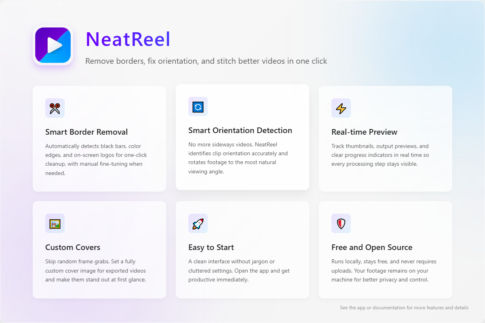

<div align="center">

[English](./README.md) | [简体中文](./README_CN.md)




# NeatReel

**Remove borders, fix orientation, and stitch better videos in one click**

Easy to use, quick to start, and built to clean up black bars from mixed video clips before export.

[](https://github.com/271374667/NeatReel/releases)
[](https://www.gnu.org/licenses/lgpl-3.0)
[](https://github.com/271374667/NeatReel/releases)
[](https://github.com/271374667/NeatReel/stargazers)

</div>

---

**NeatReel** is a lightweight desktop tool for organizing and merging videos. It is not trying to replace a full NLE. Instead, it focuses on the painful steps that usually happen before you merge clips: **previewing, fixing orientation, removing black borders, cropping, setting a cover, and exporting in different modes**.

## Learn NeatReel in 40 Seconds

The clip below shows how several videos with irregular black borders can be cleaned up, rotated to the correct orientation, and merged into a neat final output.


## 🚀 Features

<div align="center">



<div align="center">
    <p align="center">For full details, visit the documentation site.</p>
    <a href="https://271374667.github.io/NeatReel/">Open English Docs</a>
    <br />
    <a href="https://271374667.github.io/NeatReel/zh/">打开中文文档</a>
</div>

</div>

## Running the Project

### For regular users

Download the latest Windows release from GitHub Releases, extract it, and run `NeatReel.exe`.

- The current release is primarily intended for Windows 10 64-bit and Windows 11 64-bit.
- The default output directory is `output/` under the program root.
- GPU mode only works on supported NVIDIA hardware. If it fails, switch to Speed, Balanced, or Quality mode.

### Run from source

> Recommended: Python 3.11+
> Recommended dependency manager: `uv`

1. Install dependencies

```cmd
uv sync
```

2. Compile Qt resources

```cmd
uv run python scripts/compile.py
```

3. Start the app

```cmd
uv run python NeatReel.py
```

> Notes
>
> - `NeatReel.py` currently defaults to `DEBUG=False`, so you should run `scripts/compile.py` before launching from source.
> - If you want to debug directly against local `qml/` files, you can manually set `DEBUG=True` in `NeatReel.py`.

### Build

```cmd
uv run python scripts/build.py
```

Build output will be placed in `dist/NeatReel/`.

## Additional Notes

- The software is currently only verified on Windows 10 64-bit and Windows 11 64-bit.
- Only one application instance is allowed at a time. Launching it again will focus the existing window.
- The software is free. If you paid for it somewhere else, request a refund.
- If you encounter issues or have suggestions, please open an issue on GitHub.
- For more detailed usage instructions, please read the documentation site.


## 📄 License

This project is licensed under [LGPL v3](./LICENSE).

---

*NeatReel - Remove borders, fix orientation, and stitch better videos in one click.*
