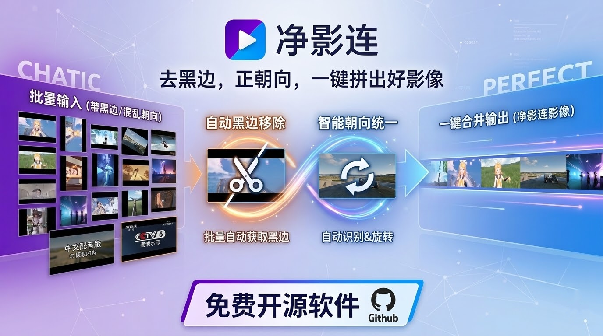
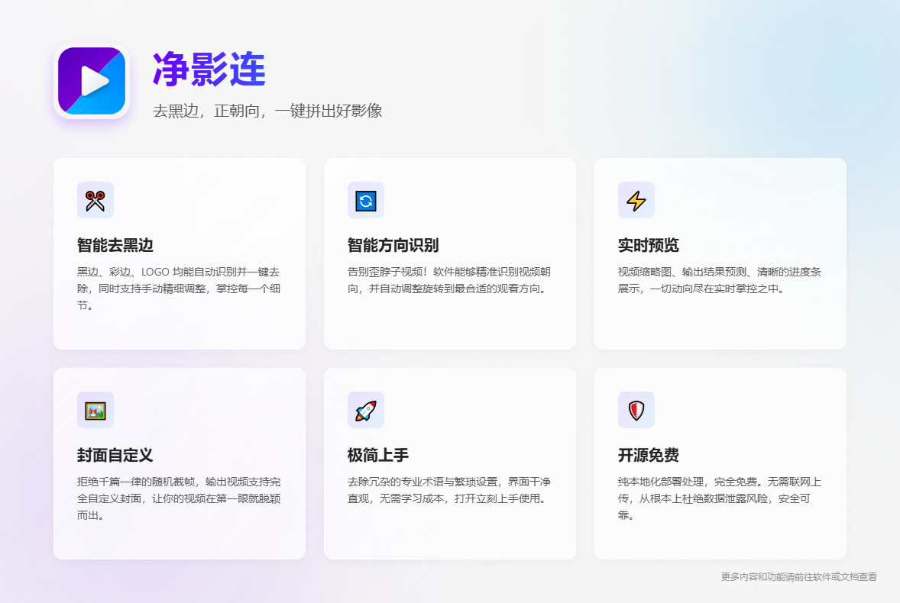

<div align="center">

[English](./README.md) | [简体中文](./README_CN.md)



# 净影连 / NeatReel

**去黑边，正朝向，一键拼出好影像**

点击即用，轻松上手，精准去除各种黑边，还您清爽视频

[](https://github.com/271374667/NeatReel/releases)
[](https://www.gnu.org/licenses/lgpl-3.0)
[](https://github.com/271374667/NeatReel/releases)
[](https://github.com/271374667/NeatReel/stargazers)

</div>

---

净影连（NeatReel）是一款面向日常使用者的视频整理与拼接工具。它不仅仅是把视频首尾相接，而是将 **预览、纠正方向、去黑边、裁剪、封面设置、多模式输出** 六个高频痛点一键解决，让多段来源不一的视频快速整合成一条规整、统一的成片。

## 40 秒了解 NeatReel

下面这个视频将会带您快速查看三个有不规则黑边的视频是如何完美去除黑边然后旋转成正确的朝向最后合并的


## 🚀功能介绍

<div align="center">



<div align="center">
    <p align="center">软件详情请前往文档进行查看</p>
    <a href="https://271374667.github.io/NeatReel/zh/">点我前往中文文档</a>
</div>

</div>

## 如何运行该项目

### 普通用户

直接通过 Release 下载最新的 Windows 版本，解压后运行 `NeatReel.exe` 即可。

- 当前主要面向 Windows 10 64 位与 Windows 11 64 位。
- 默认输出目录为程序根目录下的 `output/` 文件夹。
- GPU 模式仅适用于支持对应编码能力的 NVIDIA 显卡；不满足条件时请使用速度、均衡或质量模式。

### 源码运行（开发者）

> 推荐运行环境 Python 3.11+
> 推荐使用 `uv` 管理依赖

1. 安装依赖

```cmd
uv sync
```

2. 生成 Qt 资源文件

```cmd
uv run python scripts/compile.py
```

3. 启动应用

```cmd
uv run python NeatReel.py
```

> 说明
>
> - `NeatReel.py` 当前默认 `DEBUG=False`，因此源码运行前建议先执行一次 `scripts/compile.py`。
> - 如果你希望直接加载本地 `qml/` 文件调试，可以手动把 `NeatReel.py` 中的 `DEBUG` 改为 `True`。

### 打包

```cmd
uv run python scripts/build.py
```

打包结果位于 `dist/NeatReel/`。

## 额外说明

- 该软件目前仅在 Windows 10 64 位与 Windows 11 64 位上进行过验证，其它系统与平台不保证稳定运行
- 同一时间只允许启动一个实例；重复启动会唤起已打开的窗口
- 该软件永久免费，如果您在其他地方付费下载到了该软件请马上退款止损
- 如果您使用出现了问题或者对软件的建议请您在该页面提出 issue
- 如果您有更多的问题请前往文档查看


## 📄 许可证

本项目采用 [LGPL v3](./LICENSE) 许可证。

---

*净影连 / NeatReel —— 去黑边，正朝向，一键拼出好影像。*
